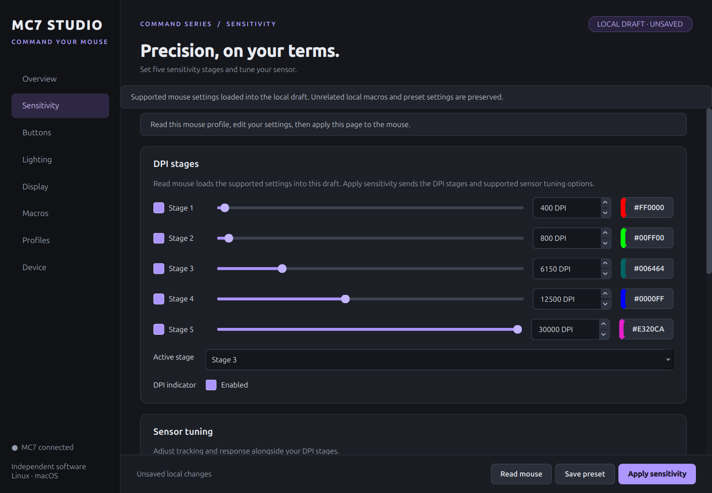

# MC7 Studio

MC7 Studio is an independent desktop configurator for the **Turtle Beach Command Series MC7** mouse. It provides a native Qt interface for Linux, macOS and Windows, so the mouse can be configured without relying on Turtle Beach Swarm II.

The Linux implementation has been tested with a directly connected MC7 running firmware 5.09. The macOS and Windows applications and USB backends are included, but still need physical-device testing.

MC7 Studio is independent software and is not affiliated with or endorsed by Turtle Beach.



## Features

- **Five onboard profiles** with explicit profile activation
- **Portable local presets** with names, colors, images, import and export
- **Sensitivity controls** for five DPI stages from 50 to 30,000 DPI, polling rate, Motion Sync, debounce, angle snapping and angle tuning
- **Guided calibration** for comfortable DPI, pointer angle and lift-off distance
- **Button remapping** on the standard and Easy-Shift layers
- **Easy-Aim and Easy-Wheel** actions, keyboard shortcuts, media controls, profile controls and mouse actions
- **Macro editor and recorder** with keyboard and mouse events, delays and Once, Repeat, While held or Toggle playback
- **Lighting controls** for color, brightness, speed and the MC7 effects
- **LCD editor** for three pages with four slots per page
- **LCD controls** for DPI, lighting, media, keys, shortcuts, macros, countdowns and system monitoring
- **Host-assisted LCD actions** for applications, websites, files, folders, OBS, screenshots, OBS Studio Mode and desktop media players
- **Custom LCD backgrounds and application icons** from PNG or JPEG files
- **Display settings** for brightness, timeout and haptic feedback
- **Battery and firmware status**, optional tray monitoring and low-battery notifications
- **Automatic profiles** based on the foreground application on supported desktops
- **In-app host setup** for Linux USB permissions, GNOME Wayland support and start at login
- **Official firmware package downloads**, guarded update preparation and settings-backup restoration

## Platform support

| Platform | Status |
| --- | --- |
| Linux | USB configuration and readback tested on firmware 5.09. X11, GNOME Wayland, Sway and Hyprland automatic-profile providers are available. |
| macOS | Desktop interface and non-exclusive HID backend are implemented. Physical MC7 configuration and firmware updating have not been validated. |
| Windows | Portable desktop application, HID configuration, automatic profiles and OBS integration are implemented. Physical MC7 configuration and firmware updating have not been validated. |

Only the Command Series MC7 is supported. The mouse must be connected directly by USB for configuration and supported firmware workflows. Receiver, wireless and Bluetooth configuration are not implemented.

## Install

Download the first release from [GitHub Releases](https://github.com/dev-zetta/swarm2/releases/latest). The AppImage is the preferred release for Linux. Portable ZIPs are provided for 64-bit Windows and Apple Silicon Macs (M1 and newer, macOS 13 or newer). The release wheel and source installation support Linux, macOS and Windows and require Python 3.10 or newer.

### Windows x86_64 portable application

Download `MC7-Studio-0.1.0-windows-x86_64.zip` and its `.sha256` file from the release. Verify the SHA-256 value, extract the complete archive to a permanent folder, and run `MC7-Studio.exe`. Windows may show an unrecognized-publisher warning because the first release is not code signed.

The portable application contains Python, Qt, HIDAPI, 7-Zip and the desktop dependencies. Keep `MC7-Studio-CLI.exe` and the `_internal` directory beside the GUI executable; the app uses them for device operations. It does not install a driver or replace Swarm II. Close Swarm II before accessing the mouse because only one configurator should own the MC7 vendor interfaces at a time.

### macOS Apple Silicon (M1 and newer)

Download `MC7-Studio-0.1.0-macos-arm64.zip` and its `.sha256` file from the release. Verify it with `shasum -a 256 -c MC7-Studio-0.1.0-macos-arm64.zip.sha256`, extract the ZIP in Finder, and move **MC7 Studio.app** to **Applications** before opening it.

The app includes Python, Qt, HIDAPI, 7-Zip and its other desktop dependencies. It requires macOS 13 or newer and runs natively on Apple Silicon. The first release uses ad-hoc signing and is not Apple notarized; if macOS blocks it, review the download and use **System Settings → Privacy & Security → Open Anyway**. Physical MC7 acceptance on macOS remains pending.

### Linux x86_64 AppImage (recommended)

Download the AppImage and its `.sha256` file from the release, verify it, move it to a permanent location, make it executable and run it:

```sh
sha256sum -c MC7-Studio-0.1.0-x86_64.AppImage.sha256
mkdir -p "$HOME/Applications"
mv MC7-Studio-0.1.0-x86_64.AppImage "$HOME/Applications/"
chmod +x "$HOME/Applications/MC7-Studio-0.1.0-x86_64.AppImage"
"$HOME/Applications/MC7-Studio-0.1.0-x86_64.AppImage"
```

The AppImage includes the application runtime, Qt, HIDAPI, `7zz`, `libusb` and the certificate trust store used for HTTPS downloads. It does not require a Python environment or system 7-Zip and libusb packages. Linux still needs the udev rule described under [First use](#first-use).

MC7 Studio does not replace the AppImage silently. Download a newer release manually or use an AppImage update tool with the release's `.zsync` metadata. Move the AppImage to its permanent path before enabling start at login; if its path changes during an update, launch the new file and update the start-at-login entry from **Device → Check and install host integration…**.

### Release wheel on Linux, macOS or Windows

Download the `.whl` file from the release, then install it in a virtual environment:

```sh
python3 -m venv ~/.local/share/mc7-studio/venv
~/.local/share/mc7-studio/venv/bin/python -m pip install '/path/to/swarm2_mc7-0.1.0-py3-none-any.whl[gui]'
~/.local/share/mc7-studio/venv/bin/swarm2-gui
```

On Windows, use `mc7-studio\Scripts\swarm2-gui.exe`; on macOS and Linux, the executables are in the environment's `bin` directory. AppImage files run only on Linux.

### From a source checkout

```sh
python3 -m venv .venv
.venv/bin/python -m pip install -e '.[gui]'
.venv/bin/swarm2-gui
```

To build the same Ubuntu 22.04 AppImage used by GitHub Actions, install Docker and run `scripts/build_appimage_docker.sh`. The script builds the pinned toolchain image, validates the packaging inputs and writes the AppImage, component inventory, update metadata and checksums to `dist/appimage`. Pass `--build-release` to also build the wheel, source distribution, firmware provenance and the verified corresponding-source archive published with tagged releases.

Windows and macOS builds run natively in GitHub Actions. To build locally, install `packaging/windows/requirements-build.txt` and run `python scripts/build_windows.py` on Windows x86_64 or `python scripts/build_macos.py` on an Apple Silicon Mac. The builders check GUI startup, the HIDAPI entry points, helper communication, image formats and bundled 7-Zip without changing a mouse.

Wine and Ghidra are not required to install or use MC7 Studio.

See [Getting started](docs/getting-started.md) for Linux prerequisites, USB access setup and the first configuration.

## First use

1. Connect the mouse directly by USB and open MC7 Studio.
2. On Linux, open **Device → Check and install host integration…** and install the USB access rule if it is missing. Reconnect the mouse afterward.
3. Select the mouse and the desired profile slot.
4. Choose **Read mouse** before editing. The initial values shown by a new installation are editor defaults.
5. Make changes on one page and choose that page's **Apply** button. MC7 Studio checks the current state and reads the result back.
6. Choose **Save preset** if you also want a reusable copy on the computer.

Saving a preset does not change the mouse. Applying a page does not save the whole local preset.

## Onboard and host-assisted features

Sensitivity, button assignments, lighting, supported macros, LCD layout and power settings are stored on the mouse and remain available after MC7 Studio closes.

Countdowns, live system values, desktop media control, application and file launching, OBS screenshots and OBS Studio Mode need MC7 Studio's LCD action listener while they are in use. Enable **Listen for timer, media and launch taps on the mouse** on the Display page after applying those tiles. The listener temporarily owns the mouse connection, so stop it before applying settings or updating firmware.

Read the [User guide](docs/user-guide.md) and [Host integrations](docs/integrations.md) for feature-specific setup.

## Firmware updates

> [!CAUTION]
> Firmware installation is experimental. Keep the mouse directly connected, keep the computer powered, and save the preparation backup before starting. Do not disconnect the mouse after transfer begins.

The native Linux updater successfully completed an official 5.04 to 5.09 MC7 upgrade. Downgrades, same-version reinstalls, interrupted-update recovery, transmitter flashing and macOS firmware installation have not been validated. Windows supports firmware package download and inspection, while firmware installation is disabled. The application enables installation only for a supported current mouse upgrade path on a platform with an implemented updater.

The backup stores readable settings and supported assigned macros. It is not a complete firmware image and cannot preserve custom background pixels, device-unique data or unknown settings. Keep original image files and exported presets separately.

See [Firmware and recovery](docs/firmware.md) before using the updater.

Turtle Beach firmware is not bundled with this project. Release artifacts may include a small provenance archive containing official URLs and checksums, but never the vendor firmware payloads.

The release includes `MC7-Studio-0.1.0-corresponding-sources.tar.gz` and its checksum. That archive retains the exact pinned upstream sources and authenticated Ubuntu source packages for the native components distributed in the AppImage. The pinned Qt Base, Qt SVG, PySide6/Shiboken6, HIDAPI, PyInstaller and 7-Zip sources also cover those components in the Windows and macOS bundles. Its `SOURCES.json` file maps every retained source file to a SHA-256 digest, while the AppImage's adjacent `.components.json` file identifies the binary payload.

## Command line

The graphical interface is the primary application. The AppImage accepts the same diagnostic commands after its filename, for example `~/Applications/MC7-Studio-0.1.0-x86_64.AppImage doctor`. Wheel and source installations also provide these commands:

```sh
swarm2 --version
swarm2 doctor
swarm2 devices
swarm2 read --profile 1
```

Add `--json` to `doctor`, `devices` or `read` for machine-readable output. Run `swarm2 --help` for all options.

## Known limitations

- macOS and Windows hardware acceptance is still pending.
- Windows firmware installation, per-application audio volume and desktop media playback-state control are unavailable.
- Start-at-login setup is currently available on Linux and macOS only.
- Receiver, wireless and Bluetooth configuration are unavailable.
- Automatic profiles are unavailable on KDE Plasma and unsupported Wayland compositors.
- Direct Studio Mode changes made inside OBS may leave its mouse icon stale; restart the LCD action listener to refresh it.
- Custom LCD image pixels cannot be read back from the mouse.
- Firmware recovery, downgrade and transmitter installation are unavailable.

For common setup and connection problems, see [Troubleshooting](docs/troubleshooting.md).

## Local data and privacy

Presets, automatic-profile rules and host choices are stored for the current user. Automatic-profile monitoring uses the foreground application's process identity and does not retain a window-history log. OBS integration connects only to the local OBS WebSocket server and does not keep a separate copy of its password.

## License

MC7 Studio's original source code is Copyright © 2026 Gabriel Max and released under the [GNU General Public License version 3 or later](LICENSE). Turtle Beach names, firmware, installers and other vendor material remain the property of their respective owners and are not covered by this license.
